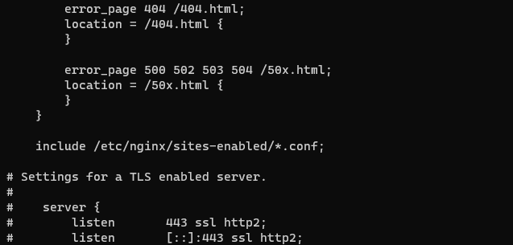

# Cài đặt và cấu hình Nginx trên CentOS 7

*Tất cả các lệnh đều được thực hiện trên tài khoản root. Nếu sử dụng tài khoản thường để thực thi lệnh mà gặp lỗi ```Permission denied```, hãy thêm ```sudo``` vào đầu mỗi lệnh.*

## Cài đặt Nginx

- Trước tiên cần cập nhật CentOS 7:

```sh
yum update
```

- Cài đặt EPEL repo:

```sh
yum install epel-release -y
```

- Cài đặt Nginx:

```sh
yum install nginx -y
```

- Khởi động dịch vụ nginx và cài đặt tự khởi chạy khi khởi động hệ điều hành:

```sh
systemctl start nginx
systemctl enable nginx
```

- Mở cổng 80 trên CentOS:

```sh
firewall-cmd --zone=public --add-port=80/tcp --permanent
```

- Khởi động lại firewall để thay đổi có hiệu lực:

```sh
firewall-cmd --reload
```

## Cấu hình Nginx

- Cấp quyền sở hữu cho user ```nginx``` và quyền chỉnh sửa đối với thư mục hoạt động của trang web:

```sh
chown nginx:nginx <đường-dẫn-thư-mục-hoạt-động-của-trang-web>
chmod -R 755 <đường-dẫn-thư-mục-hoạt-động-của-trang-web>
```

- Để tiện hơn trong việc quản lý các file cấu hình host trang web, có thể tạo 2 thư mục ```sites-available``` và ```sites-enabled``` để quản lý. Trong đó, ```sites-available``` dùng để lưu tất cả các cấu hình, còn ```sites-enabled``` dùng để kích hoạt các file cấu hình mong muốn.
- Tạo thư mục ```sites-avalable``` và ```sites-enabled```:

```sh
mkdir /etc/nginx/sites-available
mkdir /etc/nginx/sites-enabled
```

- Cấu hình file ```nginx.conf``` tại đường dẫn ```/etc/nginx/``` để nhận cấu hình của các trang trong ```sites-enabled``` bằng cách thêm ```include /etc/nginx/sites-enabled/*.conf;``` vào cuối file:



- Để kích hoạt các file cấu hình trong thư mục ```sites-avalable```, tạo soft link từ thư mục ```sites-avalable``` sang ```sites-enabled```, ví dụ:

```sh
ln -s /etc/nginx/sites-avalable/example.conf /etc/nginx/sites-enabled/example.conf
```

- Kiểm tra lỗi cấu hình nginx:

```sh
nginx -t
```

- Khởi động lại nginx để thay đổi có hiệu lực:

```sh
systemctl restart nginx
```
