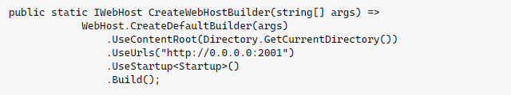
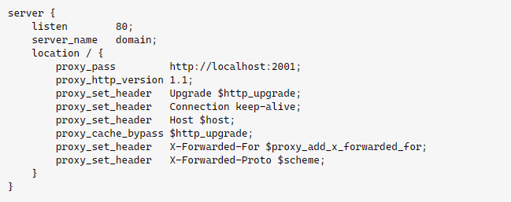

# Triển khai trang web dùng ASP.NET Core bằng Reversed Proxy Nginx trên CentOS 7

*Tất cả các lệnh đều được thực hiện trên tài khoản root. Nếu sử dụng tài khoản thường để thực thi lệnh mà gặp lỗi ```Permission denied```, hãy thêm ```sudo``` vào đầu mỗi lệnh.*

## Cài đặt ASP.NET Core

- Trước tiên, cần xác định phiên bản ASP.NET Core mà trang web đang sử dụng. Hiện tại có 2 phiên bản được hỗ trợ trên CentOS 7 là .NET 6 và 7.
- Thêm Microsoft package repository:

```sh
rpm -Uvh https://packages.microsoft.com/config/centos/7/packages-microsoft-prod.rpm
```

- Cài đặt ASP.NET Core Runtime theo phiên bản tương ứng:

```sh
yum install aspnetcore-runtime-*.0
```

Trong đó, * là phiên bản .NET tương ứng.

## Cài đặt Nginx

Tham khảo tại [đây](https://github.com/quyen0508/trienkhaihethong/blob/main/Linux/CentOS%207/C%C3%A0i%20%C4%91%E1%BA%B7t%20Web%20Server%20Nginx/C%C3%A0i%20%C4%91%E1%BA%B7t%20v%C3%A0%20c%E1%BA%A5u%20h%C3%ACnh%20Nginx.md)

## Cấu hình Nginx

- File host trang web được cấu hình như sau:

```sh
server {
    listen        80;
    server_name   example.com *.example.com;
    location / {
        proxy_pass         http://127.0.0.1:5000;
        proxy_http_version 1.1;
        proxy_set_header   Upgrade $http_upgrade;
        proxy_set_header   Connection keep-alive;
        proxy_set_header   Host $host;
        proxy_cache_bypass $http_upgrade;
        proxy_set_header   X-Forwarded-For $proxy_add_x_forwarded_for;
        proxy_set_header   X-Forwarded-Proto $scheme;
    }
}
```

- Trong đó cần chú ý đến proxy_pass: Mặc định, trang web ASP.NET Core sử dụng Kestrel lắng nghe ở cổng 5000 (listen port). Để có thể host nhiều trang web ASP.NET đồng thời, cần phải thiết lập listen port khác nhau cho từng trang web. Để thiết lập listen port, sử dụng ```.UseUrls()``` trong ```program.cs```, ví dụ:



- Ví dụ trên sử dụng cổng 2001 để nhận các request, vì vậy cần thiết lập ```proxy_pass``` với cổng tương ứng:



(Tham khảo tại [đây](https://stackoverflow.com/a/58544242))

- Khởi động lại nginx để thay đổi có hiệu lực:

```sh
systemctl restart nginx
```

## Tạo file service

- File service giúp xử lý quá trình Kestrel và quản lý ASP.NET web app bằng ```systemd```
- Tạo file service:

```sh
nano /etc/systemd/system/<tên-service>.service
```

- Nội dung file:

```sh
[Unit]
Description=Example .NET Web API App running on Linux

[Service]
WorkingDirectory=/var/www/helloapp
ExecStart=/usr/bin/dotnet /var/www/helloapp/helloapp.dll
Restart=always
# Restart service after 10 seconds if the dotnet service crashes:
RestartSec=10
KillSignal=SIGINT
SyslogIdentifier=dotnet-example
User=www-data
Environment=ASPNETCORE_ENVIRONMENT=Production
Environment=DOTNET_PRINT_TELEMETRY_MESSAGE=false

[Install]
WantedBy=multi-user.target
```

- Trong đó, cần lưu ý:
  - ```WorkingDirectory``` trỏ đến thư mục hoạt động của web app.
  - ```ExecStart``` trỏ đến file ```dll``` của web app.
  - ```User``` phải là user web server tương ứng, đối với nginx sẽ là ```nginx```.

- Khởi chạy và kiểm tra service:

```sh
systemctl start <tên-service>.service
systemctl status <tên-service>.service
```

- Khởi chạy service cùng hệ thống:

```sh
systemctl enable <tên-service>.service
```

*Tham khảo theo [hướng dẫn](https://learn.microsoft.com/en-us/aspnet/core/host-and-deploy/linux-nginx?view=aspnetcore-7.0&tabs=linux-rhel) của Microsoft*
